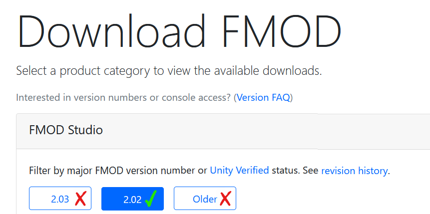

# Pizza Tower '19 Plus FMOD Studio Project Recreation
[The cover artwork for the project, featuring Peppino on a DJ mixing table and Snick breakdancing in the background.](.github/ReadMeAssets/Cover.png)

This is a (hopefully) near 1:1 recreation of the FMOD Studio Project used in the [Pizza Tower '19 Plus SAGE 2024 Demo](https://pizza-tower-19-plus.itch.io/pizza-tower-19-plus-sage-2024-demo). 
This project is for replacing songs in the Demo or creating new events for your mods.

If you are unfamiliar with FMOD Studio and how to work with it, I'd recommend reading [the Wiki pages on this GitHub repository](https://github.com/Laventory/PTP-FSPRO-Recreation/wiki)

# Quick Set-up

## Opening the Project
I'll keep it brief as I go into more detail in the wiki,  but in order to open and use the `.fspro` file hosted in this repository,  you'll need [FMOD Studio.](https://www.fmod.com) and the [Unofficial FMOD Bank Tools](https://github.com/Wouldubeinta/Fmod-Bank-Tools/releases/tag/2.0.1.13).

You'll need to have an account to download FMOD Studio itself, but aside from signing up, it's free. 

Ensure the version of FMOD Studio you download is of major revision **2.02**

Once you've gotten FMOD Studio installed, you'll now want to extract open the FMOD Bank Tools, place the `.bank` files from the Demo's `\Data\Audio` folder and put them in the FMOD Bank Tools `\bank` folder.

[Moving the original .bank files to the FMOD Bank Tools folder](.github/ReadMeAssets/BankToolsFolder.png)

Open FMOD Bank Tools and click `File -> Extract` to begin extracting the audio files to the `\wav` folder.  Once finished, move the `\music` and `\sfx` folders to the `\Assets` folder included in this Repository.

Alternatively you can also use the [`mklink` cmd command](https://learn.microsoft.com/en-us/windows-server/administration/windows-commands/mklink) to create a symbiotic link to the folders within your Assets folder to save space if you're keeping several copies of the Repository around.

[Moving the music and wav files into the Repository's Assets folder](.github/ReadMeAssets/AssetsFolder)

You should now be good to open the Project up and begin modifying it!
# Modifying the Project
When adding new events to the Project, *please* use the Event Defaults that are included in the `--DEFAULTS` folder.  They're already included in the Mixer properly and are already assigned to the default banks included in the `Mod` folder.

[The "Event Defaults" on display through the right click menu](.github/ReadmeAssets/EventDefaults.png)

# Credits
- Laventory - Maintainer
- Extended-Tangent - Wiki Proofreading and Editing
- Lerp32 - Helped me finish the cover artwork
- Raltyro - Special thanks for serving as an inspiration to creating this FSPRO Recreation project and also for letting me use the GUID matching tool from the [PT-FSPRO-Recreation](https://github.com/Raltyro/PT-FSPRO-Recreation) in this project
